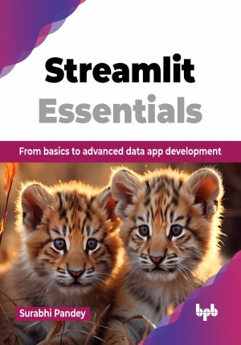

# Streamlit Essentials

From basics to advanced data app development.

This is the repository for [Streamlit Essentials
](https://bpbonline.com/products/streamlit-essentials?variant=44120255332552),published by BPB Publications.

## About the Book
Streamlit Essentials is a comprehensive guide aimed at helping you build interactive data applications using Python. With easy-to-use syntax, it allows developers to quickly build visualizations, dashboards, and machine learning models.

This book is a practical guide to building data science applications using the Streamlit framework. It covers everything from installation to advanced topics like ML integration and deployment. With real-world projects and examples, you will learn how to use Streamlit's widgets, styling, and data visualization tools to create dynamic real-time dashboards, containerize your applications with Docker, securely handle sensitive data, and deploy the applications on leading cloud platforms, all while building practical projects that can be added to enhance your portfolio.

Throughout the book, you will develop the skills needed to turn data insights into interactive visualizations, ensuring your projects are not only functional but also engaging. The focus is hands-on learning, with step-by-step guidance to help you build, optimize, and share your work. By the time you have completed this book, you will be able to confidently deploy applications, showcase your skills through a professional portfolio, and position yourself for success. 

## What You Will Learn
• Understanding of Streamlit's capabilities, from its core functionalities to advanced features.

• Create engaging and informative visualizations using Streamlit's extensive library of charts, graphs, and maps.

• Develop efficiently using time-saving techniques for rapid prototyping and iterative development.

• Optimize app performance with advanced topics like caching, session tracking, and theming.

• Create a compelling portfolio to demonstrate your Streamlit proficiency.
